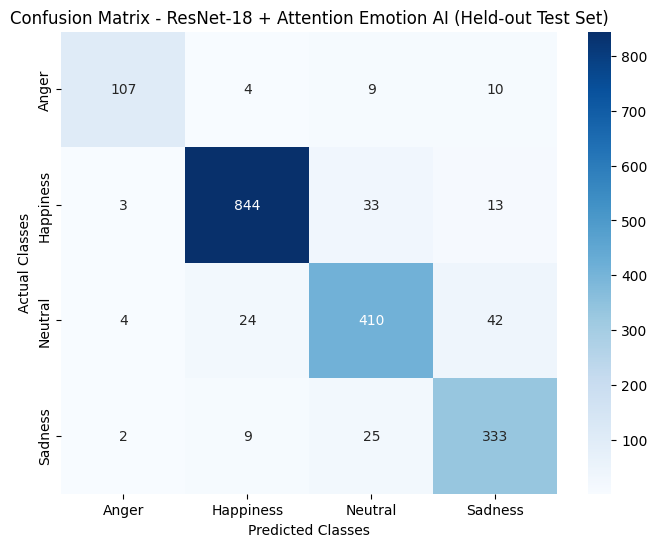
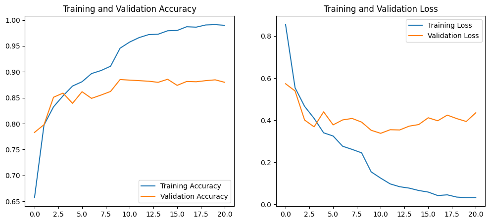

# FaceFood

**AI-Powered Facial Emotion Recognition & Food Recommendation Web Application**

FaceFood is a full-stack web application that analyzes a user's facial expression through their camera, classifies it into one of four supported emotion categories, and recommends food, drinks, ingredients, and fruits suited to that category.

---

## Overview

Food choices are often influenced by mood, but most food-discovery apps ignore that signal entirely. FaceFood explores a different entry point: instead of asking the user what they want, it analyzes their facial expression, classifies it into one of four emotion categories, and surfaces food recommendations mapped to that category — food, drinks, ingredients, and fruit — along with basic nutrition information for each item.

This is a 2-person university project built to explore the full pipeline end-to-end: training and serving a facial emotion recognition model, wiring it into a REST API, and building a camera-based web experience around it.

---

## Key Features

- Facial expression analysis from a browser camera feed
- 4-class emotion classification: Anger, Happiness, Neutral, Sadness
- Emotion-mapped food recommendations across four categories (food, drink, ingredient, fruit)
- Nutrition information displayed alongside each recommended item
- "Get new recommendations" for re-rolling suggestions within the same detected category
- Camera-based, no-signup web interface — camera frames are processed for inference and are not intentionally persisted or stored by the application
- REST API backend separating the ML/inference layer from the frontend

---

## System Workflow

```
Camera Feed
   → Face Detection (Haar Cascade)
   → Emotion Classification (ResNet18 + Multi-head Attention)
   → Emotion Category Result
   → Food Recommendation Lookup (Firebase Realtime Database)
   → Nutrition Information Display
```

FaceFood analyzes facial expressions and classifies them into one of four supported emotion categories: **Anger, Happiness, Neutral, and Sadness**. That classification result is what drives which food category is recommended — the system does not claim to know a user's actual internal emotional state, only the visual category their expression was classified into.

---

## System Architecture

```
Next.js Frontend  →  Flask REST API  →  Emotion Recognition Model (PyTorch)
                                      →  Firebase Realtime Database (food/menu data)
```

[Architecture Diagram – to be added]

- **Frontend:** Next.js 16 (App Router), calling the backend through a single typed API adapter (`src/lib/api.ts`).
- **Backend:** Flask REST API (`/api/analyze`, `/api/recommendations`) exposing the emotion model and recommendation lookups. Also serves a legacy server-rendered UI (`templates/`) from earlier in the project.
- **Model serving:** the trained PyTorch model is loaded from local disk if present, or downloaded from Google Cloud Storage at startup (`GCS_MODEL_BUCKET`) — used so the ~48MB weight file doesn't need to be baked into the deploy image or committed to git.
- **Data:** food/menu/nutrition records are read from Firebase Realtime Database.
- **Deployment target (repo-verified):** the backend includes a `Dockerfile` built for Google Cloud Run (`gunicorn`, `PORT=8080`, `.gcloudignore`) and a `Procfile`. The frontend's `.gitignore` includes Vercel-specific entries, indicating Vercel was used for frontend deployment, but no live URL is present in the repo to confirm the current deployment — *[needs user confirmation]*.

---

## Tech Stack

**Frontend**
- Next.js 16 (App Router, Turbopack)
- React 19
- TypeScript (strict)
- Tailwind CSS v4

**Backend**
- Flask 3
- Flask-CORS (origin whitelist via env var)
- Gunicorn (production WSGI server)

**AI / Machine Learning**
- PyTorch (`torch`, `torchvision`)
- ResNet18 backbone + Multi-head Attention classification head
- OpenCV (Haar Cascade face detection)

**Database**
- Firebase Realtime Database (`firebase-admin` SDK)

**Deployment / Infrastructure**
- Backend: Docker container, built for Google Cloud Run
- Model weights: Google Cloud Storage (downloaded at container startup)
- Frontend: Vercel (deployment inferred from repo config; live URL not yet confirmed in-repo)

---

## AI Model

- **Architecture:** ResNet18 backbone (ImageNet-style conv backbone) → 512-d feature embedding → `nn.MultiheadAttention` (8 heads) applied over the embedding → fully-connected classification head (Linear → BatchNorm → ReLU → Dropout → Linear).
- **Task:** facial expression classification into 4 categories — Anger, Happiness, Neutral, Sadness.
- **Face input:** faces are detected with a Haar Cascade classifier, cropped with a small margin, resized to 224×224, and normalized before being passed to the model.
- **Dataset:** RAF-DB (Real-world Affective Faces Database).

Training scripts/notebooks are not part of this repository; only the trained weights, class list, and evaluation artifacts (confusion matrix, training curves) are included.

---

## Model Performance

Evaluated on a held-out test set:

**Test Accuracy: ~90.5%**
**Weighted F1-score: ~90.5%** *(derived from the confusion matrix below — no separate saved classification report exists in the repository)*

**Confusion Matrix:**



**Training History (accuracy & loss):**



---

## Screenshots

| Home | Analyze / Camera |
|---|---|
| `docs/screenshots/home.png` *(not yet added)* | `docs/screenshots/analyze.png` *(not yet added)* |

| Emotion Result | Food Recommendation |
|---|---|
| `docs/screenshots/result.png` *(not yet added)* | `docs/screenshots/recommendations.png` *(not yet added)* |

| Error State |
|---|
| `docs/screenshots/error.png` *(not yet added)* |

> Screenshots to be added.

---

## Project Structure

```
FaceFood/
├── backend/              # Flask API, emotion model, Firebase integration
├── frontend/              # Next.js web application
├── DEPLOY_CHECKLIST.md    # Internal pre-deploy checklist
└── README.md
```

---

## API Overview

Primary API used by the frontend (see `backend/app.py`):

| Method | Endpoint | Purpose |
|---|---|---|
| `POST` | `/api/analyze` | Accepts a base64-encoded camera frame, runs face detection + emotion classification, returns the classified emotion category and confidence scores |
| `POST` | `/api/recommendations` | Returns food/drink/ingredient/fruit recommendations for a given emotion category, pulled from Firebase |

Error responses use a structured `{ "success": false, "error": { "code", "message" } }` shape, with codes including `INVALID_REQUEST`, `INVALID_IMAGE`, `NO_FACE_DETECTED`, `MODEL_ERROR`, `INVALID_EMOTION`, `DATABASE_ERROR`.

The backend also serves a small set of legacy server-rendered routes (`/`, `/analyze`, `/menu`, etc.) from an earlier iteration of the project, alongside the JSON API used by the current Next.js frontend.

---

## My Role

**Team size:** 2 (university project)

**My responsibilities:**
- Backend development
- AI/ML model training
- Firebase/backend integration
- API/model integration
- Frontend/backend integration testing

Frontend implementation was primarily handled by my teammate.

---

## Local Setup

### Frontend

```bash
cd frontend
npm install
cp .env.example .env.local
npm run dev
```

Runs at `http://localhost:3000`. Requires the backend to be running separately — there is currently no mock-data mode implemented.

### Backend

```bash
cd backend
pip install -r requirements.txt
python app.py
```

Runs at `http://localhost:5000` by default. Requires the trained model weights (`backend/models/best_resnet18_attention_emotion.pth`) to be present locally, or `GCS_MODEL_BUCKET` configured to fetch them from Cloud Storage, plus Firebase credentials configured (see Environment Variables below).

---

## Environment Variables

**Frontend** — see [`frontend/.env.example`](frontend/.env.example):
- `NEXT_PUBLIC_API_BASE_URL`
- `NEXT_PUBLIC_API_TIMEOUT_MS`

**Backend** — configured via environment variables (no `backend/.env.example` exists yet; recommended as a follow-up):
- `FIREBASE_KEY_PATH` — path to the Firebase service account credentials
- `ALLOWED_ORIGINS` — comma-separated CORS whitelist
- `GCS_MODEL_BUCKET` — Cloud Storage bucket to download model weights from, if not present locally
- `FLASK_SECRET_KEY` — Flask session secret
- `FLASK_DEBUG` — enables Flask debug mode (defaults to off)

No secret values are included here or anywhere in this repository.

---

## Deployment

**Backend:** containerized with Docker and built for Google Cloud Run (`gunicorn`, `PORT=8080`). Model weights are loaded from Google Cloud Storage at container startup rather than baked into the image.

**Frontend:** configured for Vercel deployment (inferred from repo `.gitignore` entries).

**Live Demo:** `[URL to be confirmed]`

---

## Limitations

- Facial expression classification is probabilistic and can be affected by lighting conditions, camera quality, face angle, and occlusion. It classifies expressions into one of four fixed categories and does not determine a user's actual internal emotional state.
- The model classifies only 4 broad emotion categories; it does not capture nuanced or mixed emotional states.
- Some client-side error states (e.g. `low-light`, `distance`) exist in the UI but are not yet wired up to real detection logic on either the frontend or backend.
- Food recommendations are informational and are not personalized beyond the detected emotion category.
- The production food dataset has been reviewed and corrected for identified halal-sensitive menu naming issues. The system does not currently provide formal halal certification metadata.

---

## Future Work *(proposed — not yet implemented)*

- Finalize and integrate a halal-aware food dataset into the production recommendation pipeline
- Improve recommendation personalization beyond emotion category alone
- Improve robustness of facial expression classification across lighting/pose/camera conditions
- Expand model evaluation (additional metrics, error analysis, dataset diversity)
- Wire up the currently-unused `low-light`/`distance` client error states to real detection logic

---

## Disclaimer

FaceFood is an academic/educational project built for a university course/internship portfolio. It is not a clinical or diagnostic tool: it classifies facial expressions into one of four fixed categories and does not diagnose mental health conditions or determine a user's true emotional state. Food recommendations are informational only — not medical, psychological, or nutritional treatment advice.

---

## License

MIT — see [LICENSE](LICENSE).
